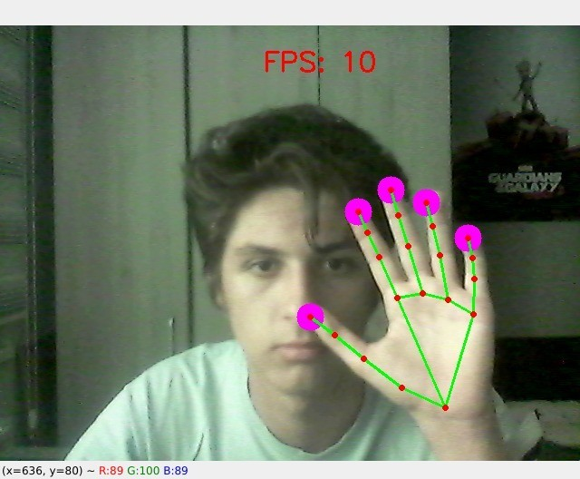

# Hand Tracking Projects
Some scripts that are based on a hand tracking algorithm written in Python and OpenCV.

Computer vision became so accessible in our days, that we can build pretty advanced scripts and projects that include AI with just some lines of code.

OpenCV is one of the best examples in the AI field. It's easy to use it and it doesn't require as much hardware as some complex Machine Learning and Deep Learning scripts. 

All scripts are written in Python and are based on the OpenCV library.

### Volume Controller

Check out Youtube for the [volume controller demo](https://youtu.be/eA_BkTWLtB0).

### Fingers counter
One of the main problems that computer vision always aims to solve is counting. Counting is a repetitive and boring. So we can use computer vision to help us.

Check out Youtube for the [fingers counter demo](https://youtu.be/eA_BkTWLtB0).

### Virtual mouse controlled by your finger
Imagine how cool would it be to control your mouse cursor using just your hand....
Oh wait, look at this ! Using computer vision, you can do this very easily ! 

Check out Youtube for the [virtual mouse demo](https://youtu.be/eA_BkTWLtB0).

 